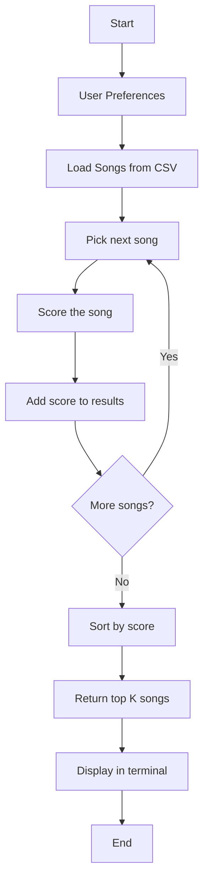
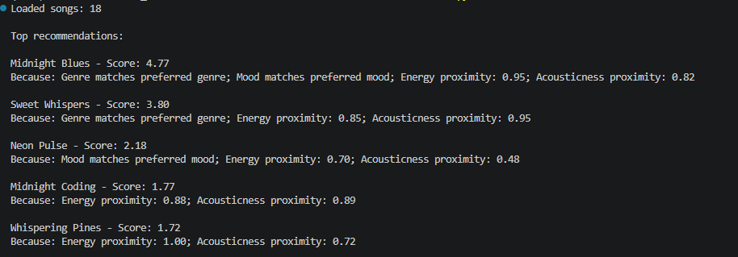
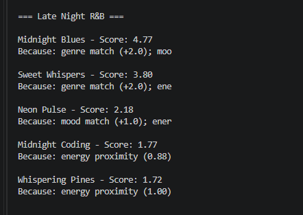
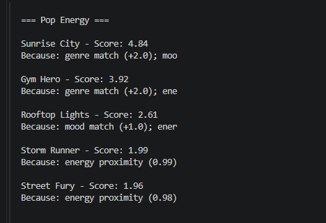
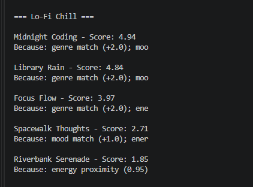

# 🎵 Music Recommender Simulation

## Project Summary

In this project you will build and explain a small music recommender system.

Your goal is to:

- Represent songs and a user "taste profile" as data
- Design a scoring rule that turns that data into recommendations
- Evaluate what your system gets right and wrong
- Reflect on how this mirrors real world AI recommenders

VibeFinder 1.0 is a content-based music recommender that scores 
18 songs against a user taste profile using genre, mood, energy, 
and acousticness. It ranks songs by weighted score and returns 
the top 5 recommendations with explanations.

---

## How The System Works

Real platforms like Spotify use two main approaches: collaborative filtering, 
which recommends songs based on what similar users listened to, and content-based 
filtering, which recommends songs based on the attributes of the song itself 
(like genre, mood, and energy). My version uses content-based filtering because 
I have a small catalog with known song attributes and no large user behavior history.

**Features each Song uses:**
- genre (e.g., pop, rock, jazz)
- mood (e.g., happy, sad, energetic)
- energy (0.0 = mellow, 1.0 = intense)
- acousticness (0.0 = electronic, 1.0 = acoustic)
- tempo_bpm (not used in scoring yet — future improvement)

**What the UserProfile stores:**
- favorite_genre
- favorite_mood
- target_energy
- target_acousticness 

**Algorithm Recipe:**
- +2.0 points for genre match
- +1.0 point for mood match  
- Up to +1.0 for energy proximity: score = 1.0 - abs(song_energy - target_energy)
- Up to +1.0 for acousticness proximity: score = 1.0 - abs(song_acousticness - target_acousticness)
- Maximum possible score: 5.0
- Songs are ranked highest to lowest, top-k returned
  
**How songs are chosen:**
Every song in the catalog gets scored, then the top-k highest scores are returned 
as recommendations.




## Terminal Output Screenshot

 

  
 
---

## Getting Started

### Setup

1. Create a virtual environment (optional but recommended):

   ```bash
   python -m venv .venv
   source .venv/bin/activate      # Mac or Linux
   .venv\Scripts\activate         # Windows

2. Install dependencies

```bash
pip install -r requirements.txt
```

3. Run the app:

```bash
python -m src.main
```

### Running Tests

Run the starter tests with:

```bash
pytest
```

You can add more tests in `tests/test_recommender.py`.

---

## Experiments You Tried

- Tested 5 user profiles: Late Night R&B, Pop Energy, Chill Lofi, 
  Adversarial Rock, and Adversarial Neutral
- Halved genre weight (2.0 to 1.0) and doubled energy weight — 
  changed Adversarial Neutral #1 from Tempest Overture to Rooftop Lights
- Discovered genre weight dominates all other scoring factors

---

## Limitations and Risks

- Only works on 18 songs, too small for real use
- Does not understand lyrics, language, or cultural context
- Over-favors genre matches due to +2.0 weight
- Binary matching means indie pop and pop are treated as different
- Ignores valence, danceability, and tempo even though they are in the data
- Top 5 results could all be the same genre

---

## Reflection

Read and complete `model_card.md`:

[**Model Card**](model_card.md)

My biggest learning moment in this project was discovering how  a single weight can create a filter bubble. When I set genre  to +2.0 points, I didn't realize it would dominate every other  factor. The adversarial experiment proved it — when I halved  the genre weight, the #1 recommendation completely changed.  That's when it clicked: real platforms like Spotify have to  carefully balance these weights or users get trapped hearing  the same thing forever.

Using Copilot throughout this project saved a lot of time but  required constant double-checking. The biggest mistake it almost caused was using inconsistent key names — "favorite_genre" in 
one file and "genre" in another — which would have broken the  scoring function silently. I learned that AI tools are great for generating structure and boilerplate, but the logic still  needs human review. I also used Copilot to expand my dataset from 10 to 18 songs, which reduced the pop/lofi bias and made stress testing more meaningful.

What surprised me most was how "real" even a simple 4-feature system feels when it works. When Midnight Blues ranked #1 with 4.77/5.0 for the Late Night Vibes profile, it genuinely felt like a good recommendation. That made me think differently about  Spotify and Apple Music — their recommendations feel magical but  are probably just much larger versions of the same math. The difference is they have millions of songs, user behavior data, and diversity logic that prevents filter bubbles from forming.
